class: center, middle

# Neural network classification of harp seal body density

## Ryan J. Dillon

University of Tromsø, Akvaplan-Niva, ArcEx

**Co-authors:** Mario Acquarone, Kagari Aoki, Marie-Anne Blanchet, Lars P. Folkow, Patrick Miller, Erling S. Nordøy, Katsufumi Sato, Pauke C. Schots, Ippei Suzuki, JoLynn Carroll, Martin Biuw


[ ](https://cicero.xyz/v3/remark/0.14.0/github.com/ryanjdillon/pres_smartmove/master/smartmove.md)

---
class: center, middle

## The idea

Realtime measurements of body density (i.e. blubber) of wild seals could tell us lots about when, where, and how much fat they are depositing and thus individual and population health, breeding success, migration, etc.

Hydrodynamic model ([*Miller et al., 2004*](http://jeb.biologists.org/content/207/11/1953))

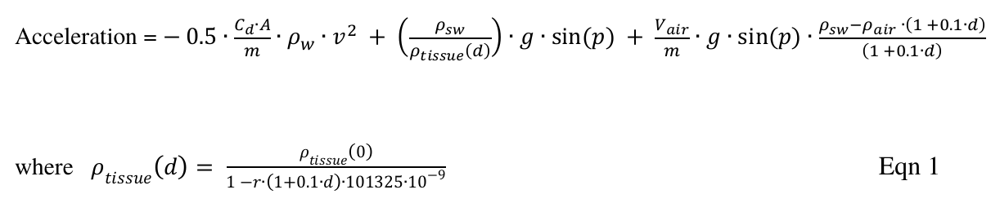

---

## Overview

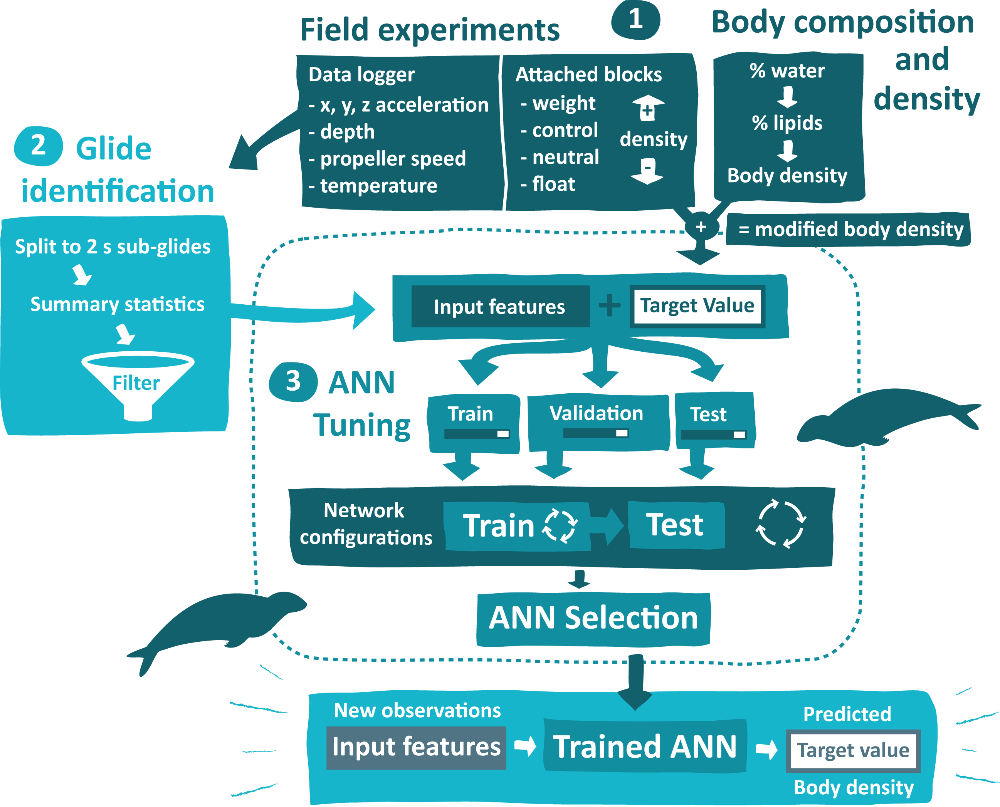

---

## Study Area

**Kaldfjord, Norway** (just outside of Tromsø)

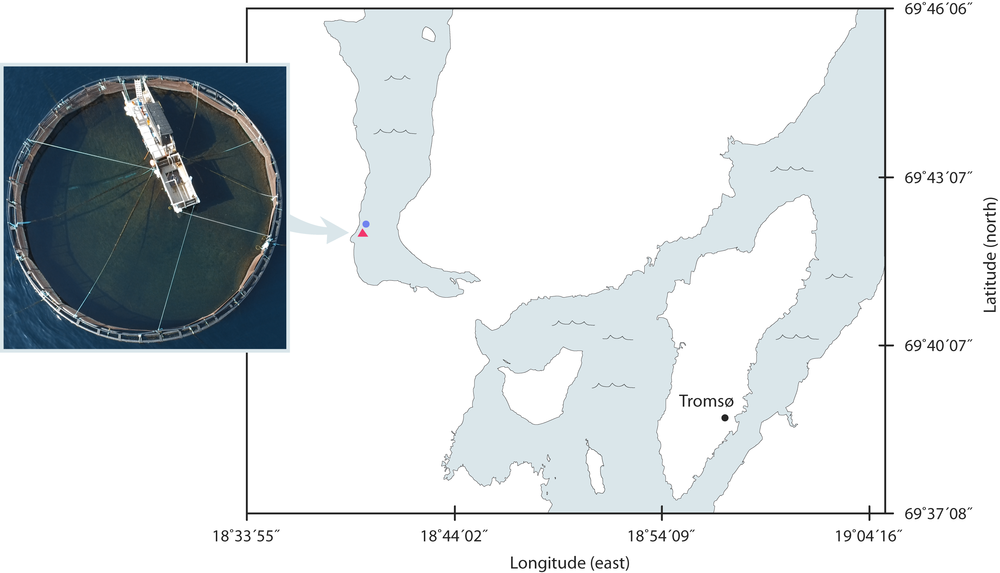

---

## Field experiments

.center[Weights and floats attached to seals to simulate changes in body density]


---

## DSP of data

Power Spectral Density plots used to determe filter cutoff frequency

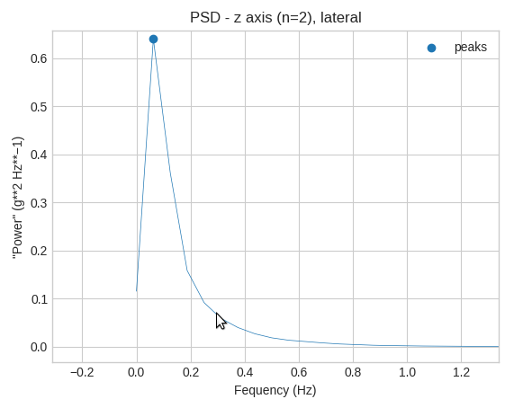
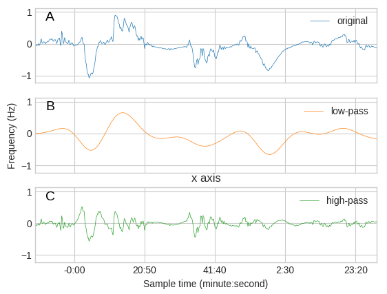

---

## Detection of glides

Glides auto-detected:
- Rate of accent (from depth sensor)
- Stroke frequency (under specified frequency animal is gliding)
- Glides subdivided to 2second intervals

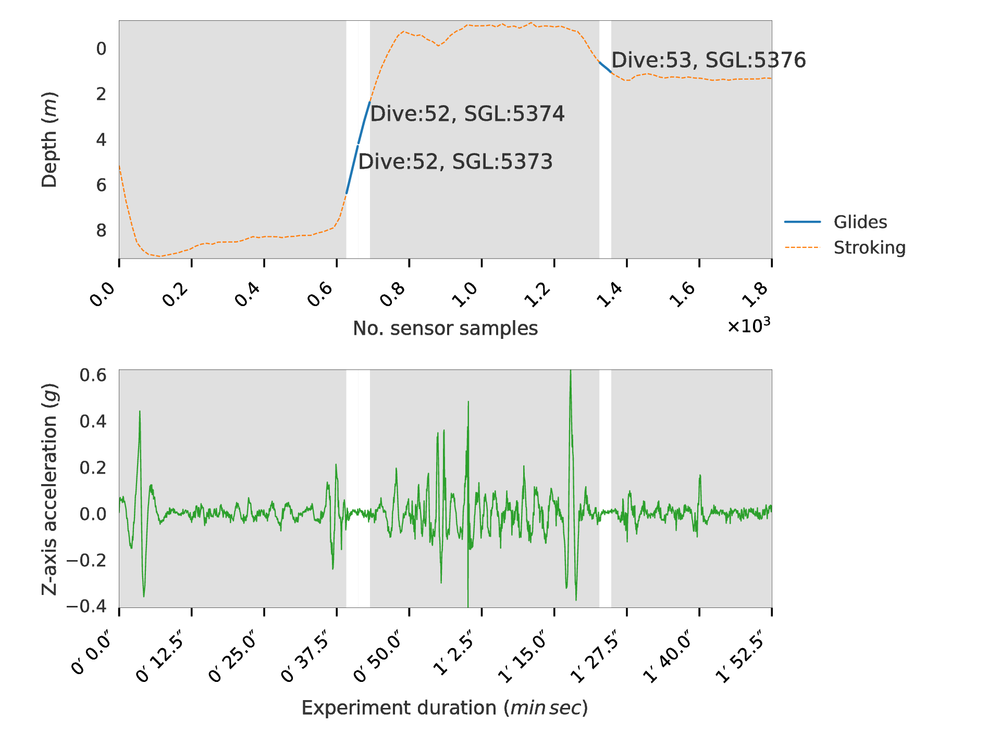

---
## Input features and target value

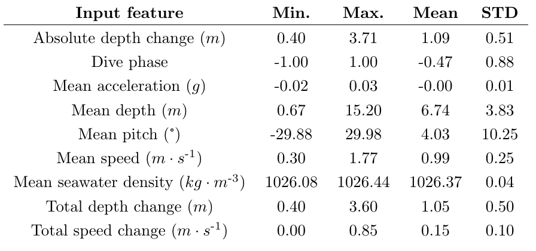
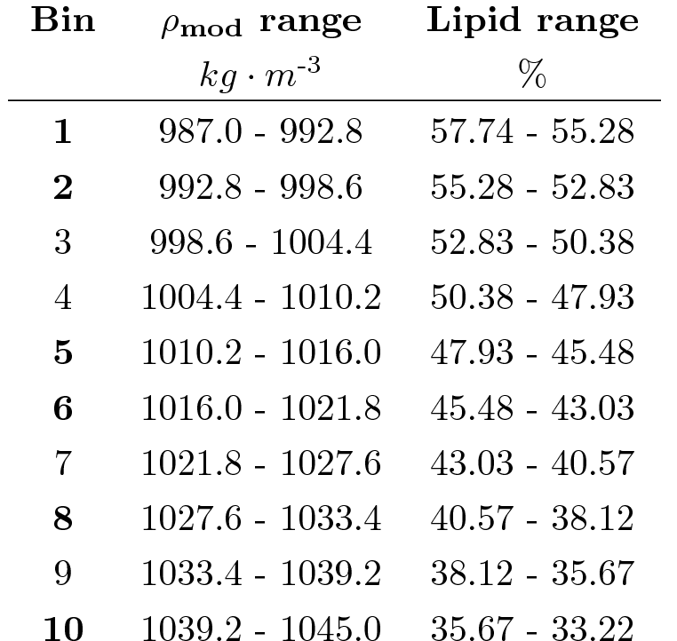

---

## Hyperparameter tuning

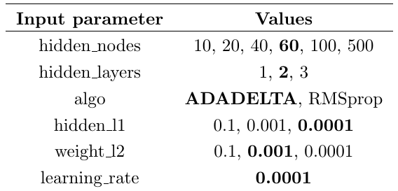

---

## Accuracy

.center[**84.8%**]

.center[Model selected on classification accuracy on unseen test set]

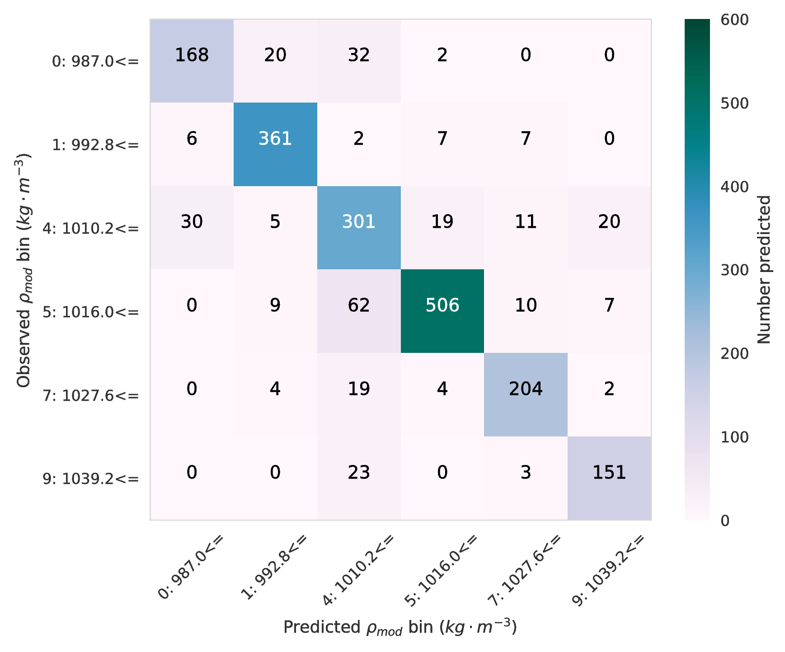

---

## Effect of Hyperparameters

Hyperparameters that affected accuracy:
- \# of hidden nodes
- \# of hidden layers

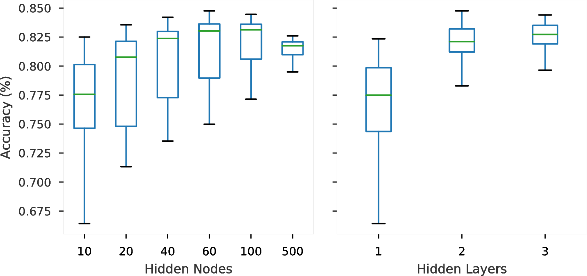

---

## Open code and data

**Install**

```bash
pip install git@github.com:ryanjdillon/smartmove.git
```

**Usage**

```python
import smartmove
smartmove.create_project('./')

# Now copy Little Leo data to `data_tag`, csv data to `data_csv`, and CTD data to `data_ctd`
# Then...

# Setup your analysis helper
anl = smartmove.Analysis('./')

# Run the glide identification
anl.run_glides()

# Run the ANN training
anl.run_ann()

# Make the figures and tables for the paper
anl.make_tables()
anl.make_figures()
```

---

## Ancillary code developed

**pyotelem**
Library for DSP of marine mammal data logger data. [Github](https://github.com/ryanjdillon/pyotelem)

**pylleo**
Calibrate and restructure accelerometry and data logger data. [Github](https://github.com/ryanjdillon/pylleo)

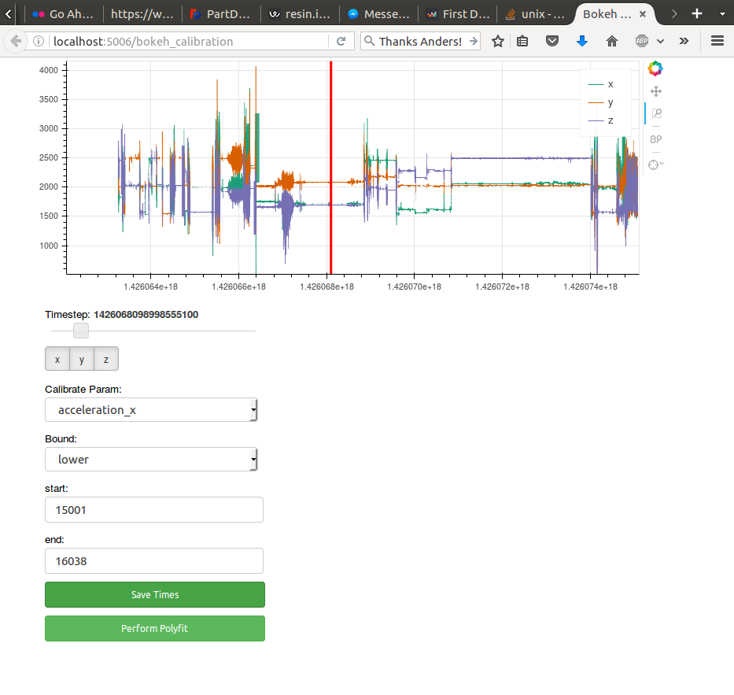

---
class: center, middle

## Thank you! Questions?
